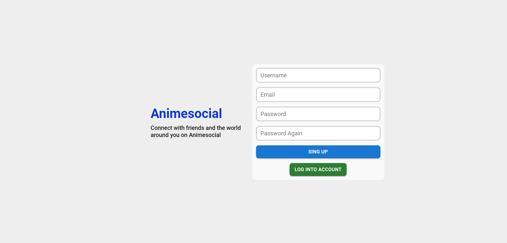
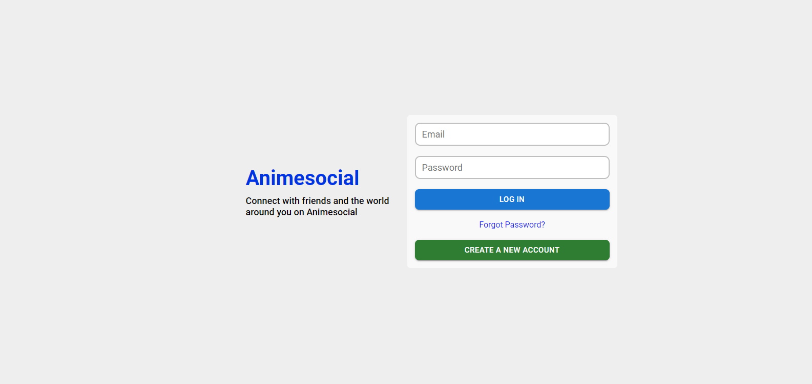
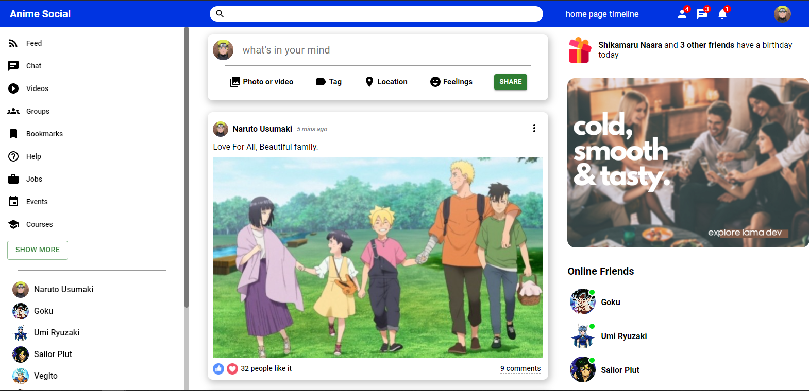
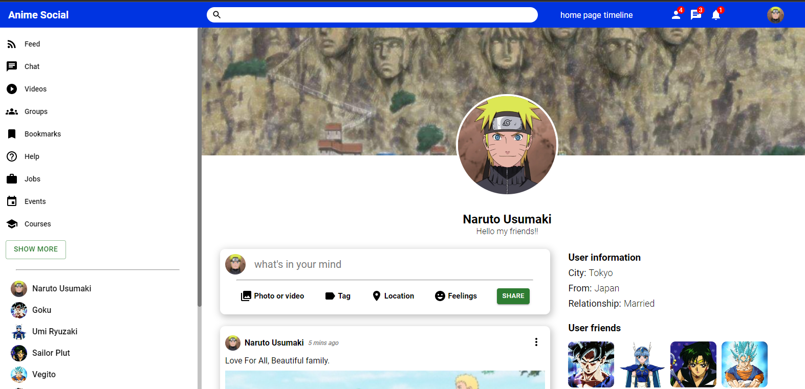

# Anime Social APP

Este proyecto esta construido con React y MUI. Realice este proyecto para incrementar mi habilidades con el front-end. Sobre la utilización de react, solo utilizo el useState para cambiar algunos estados, pero no utilizo rutas ni otros hooks ya que mi enfoque era mas en maquetación. En las imagenes se puede apreciar algo del desarrollo:
### `Register`

    

### `Login`

    

### `Home`

    

### `Profile`

    

In the project directory, you can run:

### `npm run dev`

Runs the app in the development mode.\
Open [http://localhost:3000](http://localhost:3000) to view it in the browser.

The page will reload if you make edits.\
You will also see any lint errors in the console.

### `npm vite build`

Builds the app for production to the `build` folder.\
It correctly bundles React in production mode and optimizes the build for the best performance.

The build is minified and the filenames include the hashes.\
Your app is ready to be deployed!

